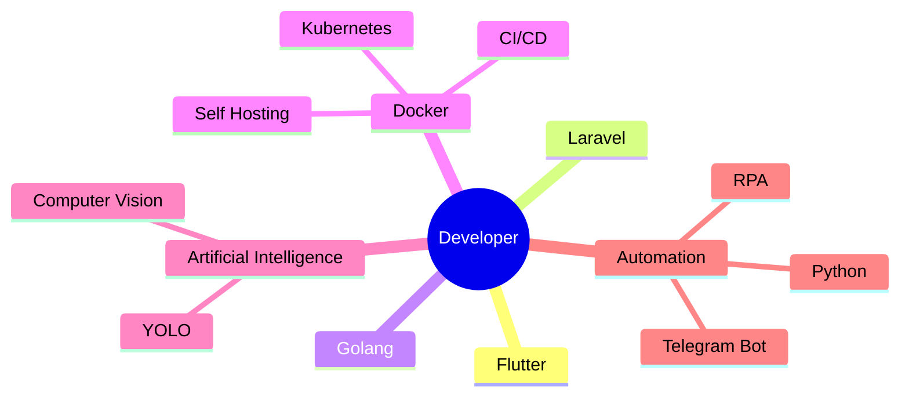

<div align="center">

# 👋 Hi, I'm Nafil Habibi


</div>

---

# ⚡ About Me

```yaml
Name:        Nafil Habibi
Location:    Indonesia 🇮🇩

Role:
  - Full Stack Developer
  - Mobile Developer
  - DevOps Engineer
  - Automation Engineer

Current Focus:
  - Flutter
  - Golang
  - Laravel
  - Docker
  - Kubernetes
  - AI Automation
  - Self Hosting

OS:
  - Arch Linux + Hyprland ❤️
```

---

# 🚀 Tech Stack

## Languages

<p align="center">


</p>

---

## Frameworks

<p align="center">


</p>

---

## DevOps

<p align="center">


</p>

---

## Database

<p align="center">


</p>

---

## Tools

<p align="center">


</p>

---

# 🧠 Things I Love

```text
🐧 Linux Customization
⚙️ DevOps & Infrastructure
🚀 CI/CD Pipeline
🤖 Automation
📱 Flutter
🐹 Golang
☁️ Docker & Kubernetes
🧠 Artificial Intelligence
👀 Computer Vision
📸 YOLO Detection
📡 Self Hosting
🛠 Server Management
```

---

# 📊 GitHub Stats

<p align="center">


</p>

---

# 🔥 Contribution Streak

<p align="center">


</p>

---

# 📈 Activity Graph

<p align="center">


</p>

---

# 🏆 GitHub Trophy

<p align="center">


</p>

---

# 🐍 Contribution Snake

<p align="center">


</p>

---

# 🚀 Current Mission



---

# 📂 Featured Projects

| Project | Description |
|----------|-------------|
| 🚀 Stackd | Universal Deployment CLI using Go |
| 📱 Flutter App | Modern Cross Platform Application |
| 🤖 AI Vision | YOLO Detection & Computer Vision |
| ☁️ Self Hosting | Docker + Kubernetes Infrastructure |
| ⚙️ Automation | Python Automation & Telegram Bot |
| 🌐 Laravel Projects | Modern Backend API |

---

# 🌍 Connect with Me

<p align="center">

<a href="https://github.com/YOUR_USERNAME">

</a>

<a href="https://linkedin.com/in/YOUR_USERNAME">

</a>

<a href="mailto:YOUR_EMAIL">

</a>

</p>

---

<div align="center">


### ⭐ Thanks for Visiting ⭐


</div>
